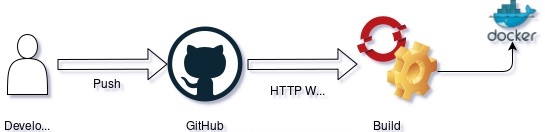

Fennica: Harmonized Finnish national bibliography
============================================

This repository contains code for cleaning, enriching and automatically generating reports on the Finnish national bibliography, [Fennica](https://www.kansalliskirjasto.fi/fi/palvelut/fennica-suomen-kansallisbibliografia). 

The live document is deployed in a CSC Rahti container:
[http://fennica-fennica.rahtiapp.fi](http://fennica-fennica.rahtiapp.fi)

This README describes how to reproduce the analyses and generate the notebook.

### Origins of the data
The data was downloaded from The National Metadata Repository Melinda. 
See more: [https://melinda.kansalliskirjasto.fi/] (https://melinda.kansalliskirjasto.fi/)

A script collect.py was used to harvest the data. See the script in the fennica repository. 
The script was provided to us by Osma Suominen (The National Library of Finland).


### Reproducing the workflow

Copy the repository to your computer:

```
# In terminal / GIT
git clone https://github.com/fennicahub/fennica.git
```

Another alternative is to download the master branch from the repository front page in GitHub: <> Code -> Download ZIP.

Go to the cloned git repository or extracted zip folder and run R. The following example assumes that the folder was downloaded to user's home folder:

```
cd fennica
R
```

Another option is to open an IDE and set the working directory to fennica folder. In RStudio this can be done in the Files tab by changing the folder to fennica folder, clicking the gear icon and selecting "Set as working directory". Alternatively, from the R Console:

```{r}
# See current working directory
getwd()
# Set working directory to fennica, assuming that fennica folder is in your current folder
setwd("fennica")
```

Install the necessary dependencies:

```{r}
install.packages("devtools")
library(devtools)
# Install deps for the current project
devtools::install_local(".")
devtools::install_deps(".", dependencies = TRUE)
devtools::install_github("comhis/comhis")
```

Render the bookdown document:

```
bookdown::render_book("inst/examples")
```

Open the rendered book in your browser. 

Alternatively, you can view the same live document deployed in a CSC Rahti container: http://fennica-fennica.rahtiapp.fi



The bookdown document is rendered with [GitHub Actions](https://github.com/fennicahub/fennica/blob/master/.github/workflows/fennica.yml). The generated files are placed in [gh-pages branch](https://github.com/fennicahub/fennica/blob/master/.github/workflows/static.yml) in the GitHub Repository. The generated files are copied to Rahti [by utilizing a webhook](https://docs.csc.fi/cloud/rahti/tutorials/webhooks/) and are hosted on an nginx server.

### Using the interactive report

The generated bookdown document consists of 20 different sections, or "chapters". Different sections focus on different fields from the MARC formatted raw data [MARC](https://marc21.kansalliskirjasto.fi). Most chapters also have visualizations that give a quick glance on what the data looks like. For most fields processed CSV datasets can also be downloaded for further analyses.

### Earlier material

Links to notebooks that are not actively maintained but may contain useful information regarding related past work.

 * [Fennica: a generic overview](https://github.com/fennicahub/fennica/blob/master/inst/examples/overview.md)
 * Presentation slide templates ([PDF](https://github.com/fennicahub/fennica/blob/master/inst/examples/slidetemplates.pdf)) and [code](https://github.com/fennicahub/fennica/blob/master/inst/examples/slidetemplates.Rmd)
 * A Quantitative Approach to Book Printing in Sweden and Finland, 1640–1828 [Source code for the figures](https://github.com/fennicahub/fennica/blob/master/inst/examples/201808-HistoricalMethods-Figures.Rmd)
 * Knowledge production in Finland 1470-1828: Digital Humanities 2016 conference presentation slides ([PDF](https://github.com/fennicahub/fennica/blob/master/inst/examples/20160715-Krakow-Fennica.pdf)) and [code](https://github.com/COMHIS/fennica/blob/master/inst/examples/20160715-Krakow-Fennica.Rmd)
 * [Figures and analyses for CCQ2019](https://gitlab.com/COMHIS/CCQ2018/blob/master/Figures.pdf)

The analyses cover several steps including XML parsing, data harmonization, removing unrecognized entries, enriching and organizing the data, carrying out statistical summaries, analysis, visualization and automated document generation.

### Licensing

The analyses and full [source code](https://github.com/comhis/fennica/blob/master/inst/examples/main.R) are provided in this repository and can be freely reused under the [BSD 2 clause](https://opensource.org/licenses/BSD-2-Clause) (FreeBSD) open source licence. The analyses are based on [R](http://r-project.org) and rely on various R packages.

The original data has been published openly by National Library of Finland.


### Acknowledgements

The project is now developed based on research and infrastructure funding from the Research Council of Finland (DHL-FI and FIN-CLARIAH). The work is based on past and present collaboration between and [Turku Data Science Group](http://datascience.utu.fi) (University of Turku), [Helsinki Computational History Group (COMHIS)](http://comhis.github.io/) (University of Helsinki) and [National library of Finland](https://www.kansalliskirjasto.fi/en/) (Fennica data collection). For the list of contributors, see [contributors](https://github.com/fennicahub/fennica/graphs/contributors) and the related publications.


### Contact

Email: yulia.matveeva@utu.fi / leo.lahti@iki.fi

The project is under active open development:

  * [Issues and bug reports](https://github.com/fennicahub/fennica/issues)
  * [Pull requests](https://github.com/fennicahub/fennica/pulls) (we will acknowledge contributions)
